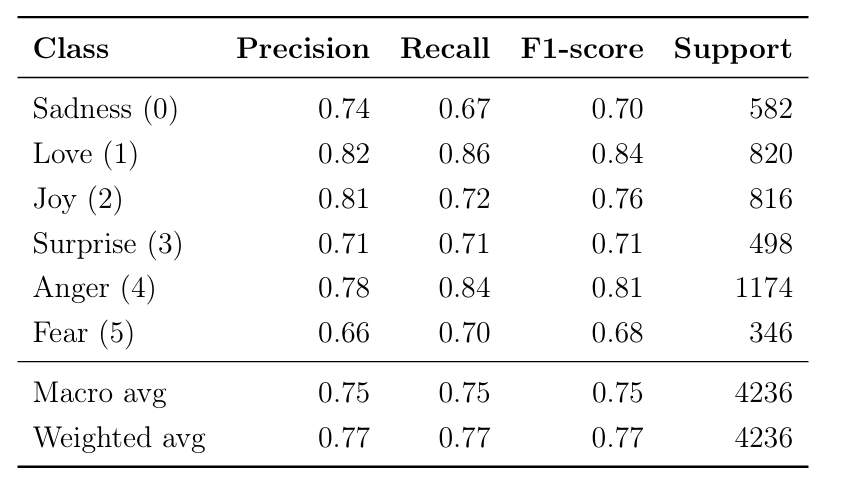
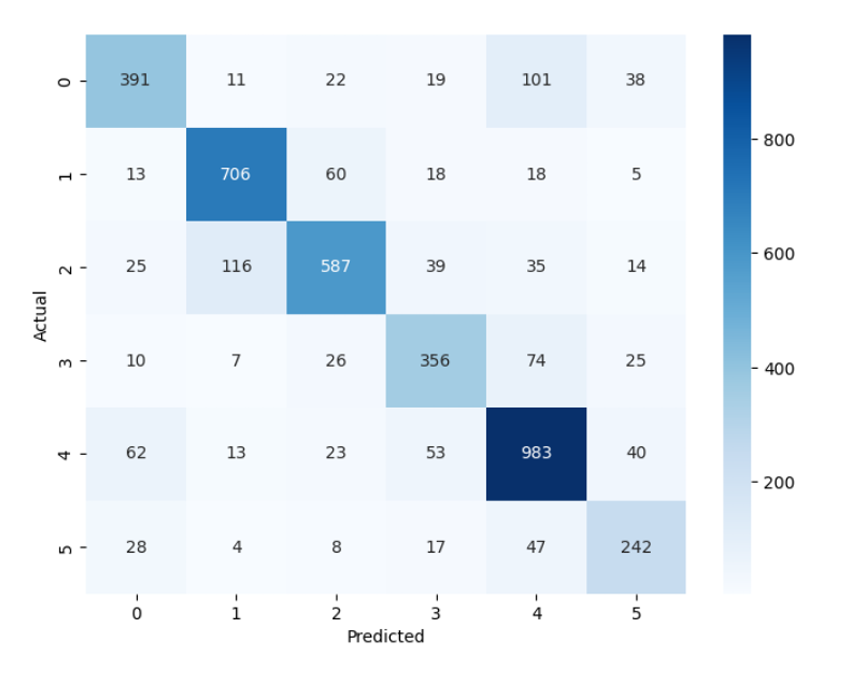

# Emotion Detection in Text using Fine-Tuned BERT


---

## Overview

This project implements an emotion classification system using a fine-tuned BERT model. The model takes a sentence as input and predicts one of six emotions:

- sadness
- love
- joy
- surprise
- anger
- fear

The project demonstrates the use of transformer-based models for Natural Language Processing tasks, including:

- data preprocessing
- tokenization
- model fine-tuning
- evaluation
- error analysis

---

## Problem Statement

Emotion detection is more detailed than traditional sentiment analysis. Instead of classifying text as simply positive or negative, emotion detection identifies the specific emotion expressed in a sentence.

This has applications in:

- social media monitoring
- customer feedback analysis
- conversational AI
- mental health analysis
- human-computer interaction

---

## Technologies Used

- Python
- PyTorch
- Hugging Face Transformers
- BERT
- DistilBERT
- pandas
- scikit-learn
- matplotlib
- seaborn
- Google Colab

---

## Dataset

This project uses the **GoEmotions** dataset released by Google Research.

Dataset source:

https://www.kaggle.com/datasets/shivamb/go-emotions-google-emotions-dataset

### Dataset Configuration

- Original format: multi-label
- Converted to: single-label classification
- Final dataset size: approximately 28,000 samples

### Selected Emotion Classes

| Emotion | Label |
|----------|--------|
| sadness | 0 |
| love | 1 |
| joy | 2 |
| surprise | 3 |
| anger | 4 |
| fear | 5 |

---

## Data Preprocessing

The preprocessing pipeline included:

- filtering the dataset to include only six emotions
- converting multi-label data into single-label classification using `idxmax`
- keeping only the `text` and `label` columns
- mapping labels to numeric IDs
- tokenizing text using the BERT tokenizer
- applying padding and truncation

### Configuration

- Maximum sequence length: 128
- Train/Validation/Test split: 70/15/15

---

## Model

### Main Model

- Model: `bert-base-uncased`
- Architecture: BERT with classification head
- Task: multi-class emotion classification

### Baseline Model

- DistilBERT
- Used for comparison under identical training conditions

---

## Training Configuration

| Parameter | Value |
|------------|-------|
| Epochs | 3 |
| Batch Size | 8 |
| Optimizer | AdamW |
| Max Sequence Length | 128 |
| Training Time | ~30 minutes |

---

## Results

### BERT Performance

| Metric | Score |
|--------|--------|
| Accuracy | 77.08% |
| Weighted F1-score | 76.98% |

### DistilBERT Performance

| Metric | Score |
|--------|--------|
| Accuracy | 76.82% |
| Weighted F1-score | 76.69% |

BERT slightly outperformed DistilBERT, confirming that the full model provides a small but consistent performance advantage on this task.

---

## Classification Report



---

## Confusion Matrix



---

## Key Observations

### Strongest Classes

- Love
- Anger

These emotions achieved the highest F1-scores due to clearer linguistic patterns.

### Most Difficult Class

- Fear

Fear-related text often overlaps semantically with sadness, anger, and surprise.

### Common Confusions

The model frequently confused:

- joy and love
- sadness and anger
- fear and surprise

These errors are expected because emotions naturally overlap in language.

---

## Project Structure

```text
Emotion_detection/
│
├── DL_Project_Code.ipynb
├── DL_Project_Report.pdf
├── README.md
├── requirements.txt
└── images/
```

---

## How to Reproduce the Results

### 1. Clone the Repository

```bash
git clone https://github.com/AssilHalawi/Emotion_detection
cd Emotion_detection
```

---

### 2. Install Dependencies

```bash
pip install transformers datasets torch scikit-learn pandas jupyter matplotlib seaborn numpy
```

---

### 3. Prepare the Dataset

Download the GoEmotions dataset from:

https://www.kaggle.com/datasets/shivamb/go-emotions-google-emotions-dataset

Steps:

- download the dataset
- filter it to include the six selected emotions
- convert multi-label data into single-label format using `idxmax`
- ensure the dataset contains:
  - a `text` column
  - a `label` column

---

### 4. Launch Jupyter Notebook

```bash
jupyter notebook
```

Open:

```bash
DL_Project_Code.ipynb
```

Run all notebook cells sequentially.

---

### 5. Train the Model

The notebook will:

- preprocess the dataset
- tokenize the text
- train the BERT model
- evaluate the model
- run inference examples

Training takes approximately 30 minutes.

---

### 6. Evaluate the Model

The notebook automatically computes:

- accuracy
- weighted F1-score
- classification report
- confusion matrix

Expected accuracy:

- approximately 77%

---

### 7. Run Inference Examples

Example:

```python
run_example(
    text="I love you so much",
    case_type="Easy case",
    expected="love",
    explanation="Strong positive emotional expression"
)
```

You can test:

- simple cases
- ambiguous cases
- edge cases
- failure cases

---

## Limitations

This project has several limitations:

- multi-label data was simplified into single-label classification
- no neutral class was included
- sarcasm and context-dependent language remain difficult
- class imbalance affected weaker classes such as fear
- only limited baseline comparisons were performed

---

## Future Improvements

Possible future extensions include:

- true multi-label classification
- adding a neutral emotion class
- testing larger transformer architectures
- hyperparameter optimization
- deploying the model as a web application

---

## Conclusion

This project demonstrates a complete NLP workflow using transformer-based deep learning models for emotion classification.

The implementation includes:

- dataset preprocessing
- BERT fine-tuning
- evaluation metrics
- confusion matrix analysis
- error analysis
- baseline comparison with DistilBERT

The final model achieved strong performance while also highlighting the challenges of emotion classification, especially for overlapping and ambiguous emotional expressions.
